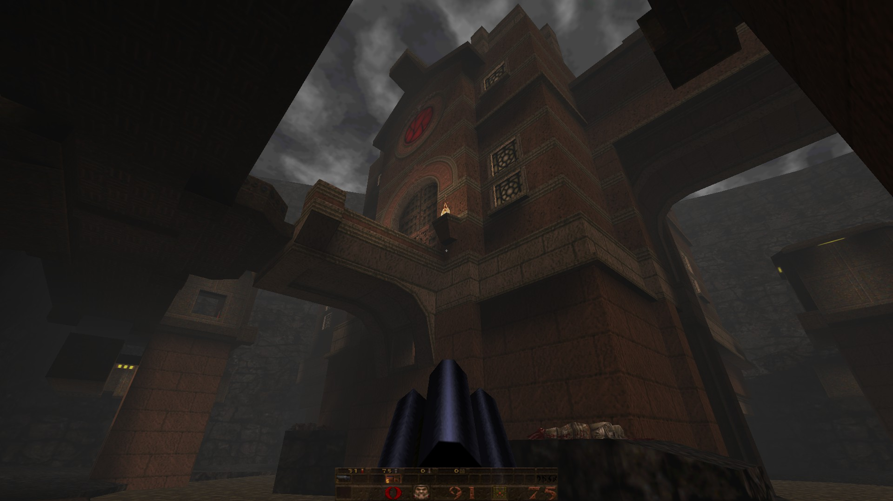
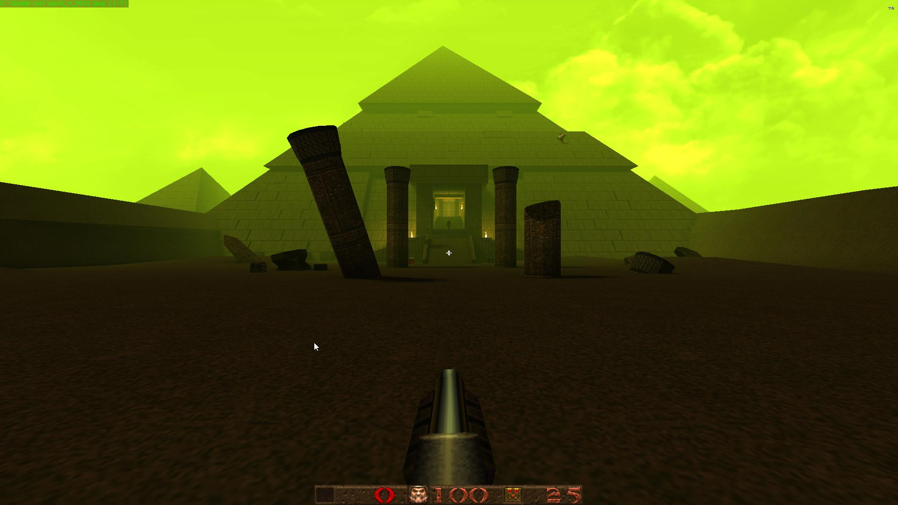

# QuakeDev
my Quake maps folder using the TrenchBroom level editor

# Files that won't upload
```
PAK0.PAK
PAK1.PAK
```
I am using a OpenGL engine of the quake engine called the [Quake Mark V](http://quakeone.com/markv/) engine.

# Previews of the Quake Mark V engine for Quake 1

<br/>

